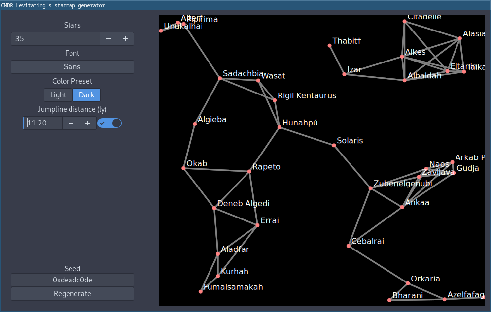

= CMDR Levitating's StarMap generator

This is a GTK tool that generates neat looking star maps.
Primarily developed for use in RPGs.

The goal is to generate good looking maps that can be printed.

